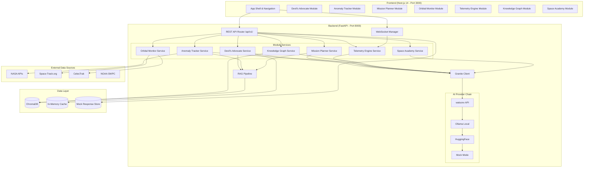
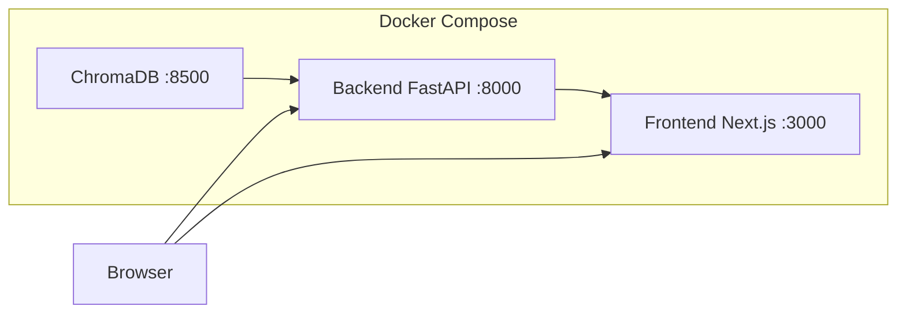
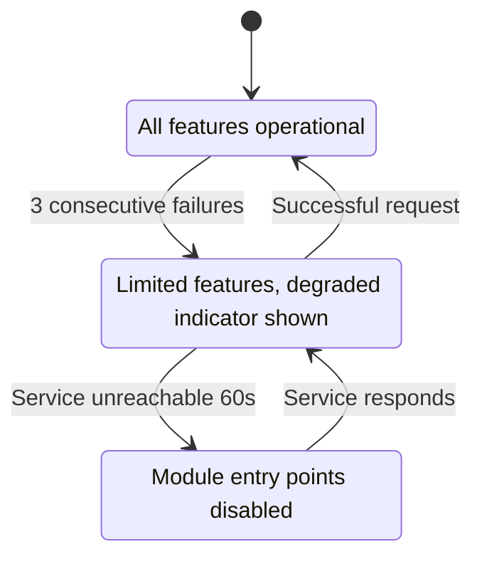
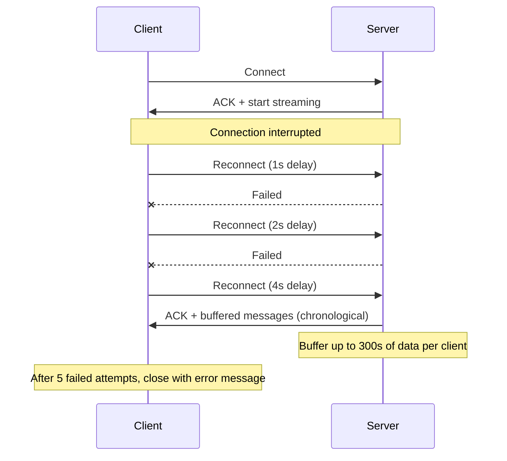

# Technical Design Document: SENTINEL Platform

## Overview

SENTINEL (AI Flight Readiness Intelligence & Mission Safety Platform) is a full-stack, 7-module AI-powered space mission safety platform designed to combat organizational blindness in spaceflight decision-making. The platform leverages IBM Granite via watsonx to provide pre-flight risk analysis, anomaly tracking, mission planning, orbital hazard monitoring, telemetry interpretation, knowledge graph exploration, and interactive education.

### Design Goals

1. **Resilience**: Multi-fallback AI provider chain with mandatory Mock Mode ensures 100% demo availability
2. **Real-time**: WebSocket-based telemetry streaming with sub-second latency
3. **Performance**: 3D rendering within 500-object budgets, lazy-loaded modules, virtualized tables
4. **Modularity**: Each of the 7 modules operates independently with graceful degradation
5. **Correctness**: Property-based testing validates round-trip serialization, risk scoring invariants, and data integrity
6. **Attribution**: IBM Granite branding on all AI content with consistent purple accent styling

### Technology Stack

| Layer | Technology |
|-------|-----------|
| Backend Runtime | Python 3.11+, FastAPI, Uvicorn |
| AI/ML | IBM Granite (watsonx), LangChain, sentence-transformers, scikit-learn |
| Vector Store | ChromaDB |
| Data Processing | pandas, numpy, NetworkX, SGP4 (sgp4 library) |
| Real-time | WebSockets (fastapi-websocket) |
| Validation | Pydantic v2 |
| Frontend Framework | Next.js 14 (App Router), React 18, TypeScript |
| Styling | Tailwind CSS, Shadcn/UI, Framer Motion |
| Visualization | D3.js, Recharts, React Three Fiber (@react-three/fiber) |
| Deployment | Docker Compose |
| External Data | NASA APIs, Space-Track.org, CelesTrak, NOAA SWPC |

---

## Architecture

### High-Level System Architecture



### Backend Architecture Pattern

The backend follows a **layered service architecture**:

1. **API Layer** (Routers): FastAPI routers handling HTTP/WebSocket requests, validation, CORS
2. **Service Layer**: Business logic for each module, orchestrates AI calls and data processing
3. **Client Layer** (Granite Client): Multi-fallback AI provider abstraction
4. **Data Layer**: ChromaDB for RAG, in-memory cache for runtime state, mock store for demo mode
5. **Integration Layer**: External data source connectors with retry logic and caching

### Frontend Architecture Pattern

The frontend uses **module-based code splitting** with the Next.js App Router:

1. **App Shell**: Persistent navigation, theme provider, WebSocket connection manager
2. **Module Pages**: Lazy-loaded route-based code splitting per module
3. **Shared Components**: Design system components (status badges, AI attribution, charts)
4. **State Management**: React Context for global state (connection status, mock mode), per-module local state
5. **Real-time Layer**: WebSocket hook with reconnection logic and message buffering

### Deployment Architecture



Startup order: ChromaDB -> Backend (seeds data + mock responses) -> Frontend

---

## Components and Interfaces

### 1. Granite Client (`backend/clients/granite_client.py`)

The multi-fallback AI client is the central abstraction for all AI inference.

```python
class GraniteClient:
    """Multi-fallback AI client with watsonx -> Ollama -> HuggingFace -> Mock chain."""
    
    async def generate(self, prompt: str, category: str) -> GraniteResponse:
        """Execute prompt through fallback chain with 10s timeout per provider."""
    
    def get_active_provider(self) -> str:
        """Return the currently active provider name."""
    
    def is_mock_mode(self) -> bool:
        """Return whether mock mode is active."""
```

**Interface Contract**:
- Input: `prompt: str`, `category: str` (for mock response lookup)
- Output: `GraniteResponse` with fields: `content`, `model_name`, `model_version`, `provider`, `is_mock`
- Timeout: 10 seconds per provider, 30 seconds total maximum
- Fallback logging: provider name, error type, elapsed time, next provider

### 2. Devil's Advocate Engine (`backend/services/devils_advocate.py`)

```python
class DevilsAdvocateService:
    async def analyze_risk(self, mission_id: str, risk_factors: list) -> RiskAnalysisReport:
        """Generate devil's advocate report with cumulative risk scoring."""
    
    async def detect_go_fever(self, document: str) -> GoFeverAnalysis:
        """NLP-based go-fever bias detection on decision documents."""
    
    def compute_cumulative_risk(self, program_id: str, new_factor: RiskFactor) -> CumulativeRiskPoint:
        """Compute compounding risk score for program timeline."""
```

**API Endpoints**:
- `POST /api/v1/devils_advocate/analyze` - Full risk analysis
- `POST /api/v1/devils_advocate/go_fever` - Bias detection
- `GET /api/v1/devils_advocate/timeline/{program_id}` - Risk timeline
- `GET /api/v1/devils_advocate/case_study/starliner` - Starliner CFT demo

### 3. Anomaly Tracker (`backend/services/anomaly_tracker.py`)

```python
class AnomalyTrackerService:
    async def ingest_data(self, telemetry: TelemetryInput) -> DetectionResult:
        """Analyze telemetry for anomalous patterns within 10s."""
    
    async def get_patterns(self, program_id: str) -> AnomalyPatternReport:
        """Retrieve cross-mission anomaly patterns and escalation alerts."""
    
    def detect_escalation(self, category: str, program_id: str) -> Optional[EscalationAlert]:
        """Check for severity/frequency escalation in rolling 30-day window."""
```

**API Endpoints**:
- `POST /api/v1/anomaly_tracker/ingest` - Ingest new data
- `GET /api/v1/anomaly_tracker/patterns/{program_id}` - Pattern analysis
- `GET /api/v1/anomaly_tracker/alerts/{program_id}` - Active escalation alerts

### 4. Mission Planner (`backend/services/mission_planner.py`)

```python
class MissionPlannerService:
    async def generate_plan(self, params: MissionParameters) -> MissionTimeline:
        """AI-generated timeline with safety margins and risk annotations."""
    
    async def generate_checklist(self, plan_id: str) -> PreFlightChecklist:
        """Auto-generate pre-flight checklist from mission profile."""
    
    async def recalculate(self, plan_id: str, risk_change: RiskChange) -> MissionTimeline:
        """Recalculate timeline within 5s of risk factor change."""
```

**API Endpoints**:
- `POST /api/v1/mission_planner/generate` - Generate mission plan
- `GET /api/v1/mission_planner/plan/{plan_id}` - Retrieve plan
- `POST /api/v1/mission_planner/plan/{plan_id}/recalculate` - Recalculate on risk change
- `GET /api/v1/mission_planner/plan/{plan_id}/checklist` - Pre-flight checklist

### 5. Orbital Monitor (`backend/services/orbital_monitor.py`)

```python
class OrbitalMonitorService:
    async def load_tle_data(self, source: str) -> TLELoadResult:
        """Parse TLE data using SGP4 propagation, compute positions within 5s."""
    
    def compute_conjunctions(self, objects: list[OrbitalObject]) -> list[Conjunction]:
        """Identify objects within 10km approach distance."""
    
    def assess_collision_risk(self, conjunction: Conjunction) -> CollisionAssessment:
        """Compute collision probability and time-to-closest-approach."""
```

**API Endpoints**:
- `GET /api/v1/orbital_monitor/objects` - List tracked objects (paginated)
- `GET /api/v1/orbital_monitor/conjunctions` - Active conjunction warnings
- `GET /api/v1/orbital_monitor/conjunction/{id}` - Conjunction detail
- `POST /api/v1/orbital_monitor/tle/load` - Load/refresh TLE data

### 6. Telemetry Engine (`backend/services/telemetry_engine.py`)

```python
class TelemetryEngineService:
    async def translate(self, data_point: TelemetryDataPoint) -> TelemetryInsight:
        """Translate raw telemetry to plain-English within 2s."""
    
    def classify_trend(self, parameter: str) -> TrendClassification:
        """Classify trend as improving/stable/degrading from rolling history."""
    
    async def generate_recommendation(self, parameter: str, condition: str) -> Recommendation:
        """Generate actionable recommendation for out-of-bounds parameter."""
```

**WebSocket Endpoint**: `ws://localhost:8000/api/v1/telemetry_engine/stream`
- Push interval: configurable 100ms-10s (default: 1s)
- Message format: JSON with timestamp, parameter, value, unit, status
- Supports up to 50 concurrent connections with independent delivery

### 7. Knowledge Graph (`backend/services/knowledge_graph.py`)

```python
class KnowledgeGraphService:
    async def query(self, query_text: str, top_k: int = 5) -> KnowledgeQueryResult:
        """RAG query with ChromaDB retrieval and Granite generation."""
    
    def get_graph_data(self, max_nodes: int = 200) -> GraphData:
        """Return graph nodes and edges for D3.js visualization."""
    
    def get_incident(self, incident_id: str) -> IncidentRecord:
        """Retrieve full incident record by ID."""
    
    async def add_incident(self, incident: IncidentInput) -> str:
        """Add incident, re-index in ChromaDB within 30s."""
```

**API Endpoints**:
- `POST /api/v1/knowledge_graph/query` - RAG-powered query
- `GET /api/v1/knowledge_graph/graph` - Graph visualization data
- `GET /api/v1/knowledge_graph/incident/{id}` - Incident detail
- `POST /api/v1/knowledge_graph/incident` - Add new incident

### 8. Space Academy (`backend/services/space_academy.py`)

```python
class SpaceAcademyService:
    async def start_simulation(self, scenario_id: str) -> SimulationScenario:
        """Present historical decision scenario with constraints."""
    
    async def submit_decision(self, session_id: str, decision: str) -> SimulationOutcome:
        """Reveal outcome and AI analysis within 5s."""
    
    async def generate_quiz(self, difficulty: str, count: int) -> Quiz:
        """Generate quiz questions from incident data via Granite."""
    
    def compute_difficulty(self, user_score: float, current_level: str) -> str:
        """Adapt difficulty: >80% advance, <50% descend, else maintain."""
```

**API Endpoints**:
- `POST /api/v1/space_academy/simulation/start` - Start simulation
- `POST /api/v1/space_academy/simulation/decide` - Submit decision
- `POST /api/v1/space_academy/quiz/generate` - Generate quiz
- `POST /api/v1/space_academy/quiz/submit` - Submit quiz answers

### 9. RAG Pipeline (`backend/services/rag_pipeline.py`)

```python
class RAGPipeline:
    async def retrieve(self, query: str, top_k: int = 5) -> list[RetrievedChunk]:
        """Retrieve top-k chunks from ChromaDB with similarity >= 0.3."""
    
    async def generate_with_context(self, query: str, chunks: list[RetrievedChunk]) -> RAGResponse:
        """Construct prompt with context and generate via Granite."""
    
    def embed_document(self, document: IncidentDocument) -> list[EmbeddedChunk]:
        """Chunk and embed incident document (max 512 tokens/chunk)."""
    
    async def keyword_fallback(self, query: str, top_k: int = 5) -> list[RetrievedChunk]:
        """Keyword-based search when ChromaDB is unavailable."""
```

### 10. WebSocket Manager (`backend/services/websocket_manager.py`)

```python
class WebSocketManager:
    async def connect(self, websocket: WebSocket) -> str:
        """Accept connection, return client_id. Max 50 concurrent."""
    
    async def disconnect(self, client_id: str) -> None:
        """Release resources within 2s of graceful disconnect."""
    
    async def broadcast(self, message: TelemetryMessage) -> None:
        """Push to all connected clients independently."""
    
    def buffer_for_client(self, client_id: str, message: TelemetryMessage) -> None:
        """Buffer messages for disconnected client (up to 300s)."""
```

### 11. Data Source Connectors (`backend/connectors/`)

```python
class NASAConnector:
    """Polls NASA APIs every 24h with 30s timeout, 3 retries."""

class SpaceTrackConnector:
    """Retrieves TLE data every 4h from Space-Track.org and CelesTrak."""

class NOAAConnector:
    """Retrieves space weather from NOAA SWPC every 60min."""
```

All connectors implement:
- Configurable polling intervals
- 30-second connection timeout
- 3 retries with 10-second spacing
- Schema validation on ingestion
- Cache with 72-hour staleness threshold

### 12. Frontend Design System (`frontend/lib/design-system/`)

```typescript
// Status color mapping
const STATUS_COLORS = {
  nominal: '#10B981',   // green
  advisory: '#3B82F6',  // blue
  caution: '#F59E0B',   // yellow
  warning: '#F97316',   // orange
  critical: '#EF4444',  // red
} as const;

// AI attribution component
function GraniteAttribution({ provider, modelVersion }: Props): JSX.Element;

// Status badge with color + icon (non-color indicator)
function StatusBadge({ level }: { level: SeverityLevel }): JSX.Element;
```

---

## Data Models

### Core API Envelope

```python
class APIResponse(BaseModel, Generic[T]):
    status: Literal["success", "error"]
    data: Optional[T] = None
    error: Optional[APIError] = None

class APIError(BaseModel):
    message: str
    id: str  # Unique opaque error identifier
    validation_errors: Optional[list[ValidationFailure]] = None

class ValidationFailure(BaseModel):
    field: str
    constraint: str
    rejected_value: Any
```

### Granite Client Models

```python
class GraniteResponse(BaseModel):
    content: str
    model_name: str = "ibm/granite-13b-chat-v2"
    model_version: str
    provider: Literal["watsonx", "ollama", "huggingface", "mock"]
    is_mock: bool = False
    metadata: dict = {}

class FallbackEvent(BaseModel):
    failed_provider: str
    error_type: Literal["timeout", "connection_error", "http_error"]
    http_status: Optional[int] = None
    elapsed_ms: float
    next_provider: str
    timestamp: datetime
```

### Devil's Advocate Models

```python
class RiskFactor(BaseModel):
    id: str
    name: str
    description: str
    severity: SeverityLevel
    historical_precedents: list[HistoricalPrecedent]
    contributing_score: float  # 0.0 - 1.0

class CumulativeRiskPoint(BaseModel):
    event_id: str
    individual_contribution: float
    pre_event_score: float
    post_event_score: float  # clamped to 1.0
    timestamp: datetime

class RiskAnalysisReport(BaseModel):
    mission_id: str
    risk_factors: list[RiskFactor]
    cumulative_risk_score: float  # 0.0 - 1.0
    severity_level: SeverityLevel
    go_fever_indicators: list[GoFeverIndicator]
    recommendation: Literal["proceed", "caution", "hold"]
    historical_precedents: list[HistoricalPrecedent]
    generated_at: datetime
    granite_attribution: GraniteAttribution

class GoFeverIndicator(BaseModel):
    indicator_type: Literal["schedule_pressure", "normalization_of_deviance", 
                            "dissent_suppression", "appeal_to_authority"]
    confidence: float  # 0.0 - 1.0, only >= 0.3 included
    source_text: str
    char_offset_start: int
    char_offset_end: int
    mitigation: str

class SeverityLevel(str, Enum):
    NOMINAL = "nominal"       # 0.0 - 0.2
    ADVISORY = "advisory"     # > 0.2 - 0.4
    CAUTION = "caution"       # > 0.4 - 0.6
    WARNING = "warning"       # > 0.6 - 0.8
    CRITICAL = "critical"     # > 0.8 - 1.0
```

### Anomaly Tracker Models

```python
class AnomalyDetection(BaseModel):
    id: str
    category: str
    affected_system: str
    severity: SeverityLevel
    timestamp: datetime
    program_id: str
    mission_id: str
    raw_data: dict

class AnomalyPattern(BaseModel):
    category: str
    occurrence_count: int
    missions_affected: list[str]
    frequency_trend: float  # occurrences per 30-day window
    severity_trend: list[SeverityLevel]
    time_between_occurrences: list[float]  # days
    is_systemic: bool  # True if 2+ missions affected

class EscalationAlert(BaseModel):
    category: str
    current_severity: SeverityLevel
    previous_severity: SeverityLevel
    frequency_multiplier: float  # current_30d / prior_30d
    historical_precedents: list[str]
    generated_at: datetime
```

### Mission Planner Models

```python
class MissionParameters(BaseModel):
    vehicle_type: str
    mission_duration_hours: float
    crew_size: int
    destination: str
    resource_constraints: Optional[list[ResourceConstraint]] = None

class MissionTimeline(BaseModel):
    id: str
    phases: list[MissionPhase]
    milestones: list[Milestone]
    resource_allocations: list[ResourceAllocation]
    conflicts: list[ResourceConflict]
    risk_annotations: Optional[list[RiskAnnotation]] = None
    degraded_mode: bool = False  # True when Devil's Advocate unavailable

class MissionPhase(BaseModel):
    id: str
    name: str
    start_offset_hours: float
    duration_hours: float
    safety_margin_hours: float  # >= 10% of duration
    risk_score: Optional[float] = None
    risk_level: Optional[SeverityLevel] = None

class ResourceConflict(BaseModel):
    activity_a: str
    activity_b: str
    contested_resource: str
    overlap_start: datetime
    overlap_end: datetime
```

### Orbital Monitor Models

```python
class OrbitalObject(BaseModel):
    norad_id: str
    name: str
    tle_line1: str
    tle_line2: str
    position: Position3D
    velocity: Velocity3D
    epoch: datetime

class Position3D(BaseModel):
    x_km: float
    y_km: float
    z_km: float

class Conjunction(BaseModel):
    id: str
    object_a: OrbitalObject
    object_b: OrbitalObject
    distance_km: float
    collision_probability: float
    time_to_closest_approach: datetime
    maneuver_windows: list[ManeuverWindow]

class TLELoadResult(BaseModel):
    total_records: int
    successful: int
    failed: int
    failed_record_indices: list[int]
    load_time_ms: float
```

### Telemetry Models

```python
class TelemetryDataPoint(BaseModel):
    timestamp: datetime  # ISO 8601
    parameter: str
    value: float
    unit: str
    status: SeverityLevel

class TelemetryInsight(BaseModel):
    parameter: str
    value: float
    unit: str
    status: SeverityLevel
    interpretation: str  # Plain-English summary
    trend: Optional[TrendClassification] = None
    recommendation: Optional[Recommendation] = None
    granite_attribution: Optional[GraniteAttribution] = None

class TrendClassification(BaseModel):
    direction: Literal["improving", "stable", "degrading"]
    rate_of_change: float
    data_points_analyzed: int

class Recommendation(BaseModel):
    condition: str
    possible_causes: list[str]  # up to 3
    suggested_actions: list[str]  # at least 1
```

### Knowledge Graph Models

```python
class IncidentRecord(BaseModel):
    id: str
    date: str
    mission: str
    vehicle: str
    root_cause: str
    contributing_factors: list[str]  # 1-10 items
    outcome: str
    lessons_learned: str
    related_incidents: list[str]  # incident IDs
    is_complete: bool = True  # False if any field is "unknown"

class GraphNode(BaseModel):
    id: str
    label: str
    type: Literal["incident", "cause", "system", "mission"]
    connection_count: int
    metadata: dict

class GraphEdge(BaseModel):
    source: str
    target: str
    relationship: str

class GraphData(BaseModel):
    nodes: list[GraphNode]  # max 200 per view
    edges: list[GraphEdge]

class KnowledgeQueryResult(BaseModel):
    query: str
    response: str
    citations: list[Citation]
    granite_attribution: GraniteAttribution
    is_cached: bool = False

class Citation(BaseModel):
    incident_name: str
    section: str
    similarity_score: float
```

### WebSocket Models

```python
class WebSocketMessage(BaseModel):
    timestamp: str  # ISO 8601
    parameter: str
    value: float
    unit: str
    status: Literal["nominal", "advisory", "caution", "warning", "critical"]

class WebSocketStatusMessage(BaseModel):
    type: Literal["data_unavailable", "connection_error", "reconnecting"]
    message: str
    timestamp: str
```

### Space Academy Models

```python
class SimulationScenario(BaseModel):
    id: str
    incident_source: str
    narrative: str
    time_pressure: str
    available_data: list[str]
    conflicting_advisories: list[str]
    choices: list[str]

class SimulationOutcome(BaseModel):
    historical_outcome: str
    explanation: str
    ai_analysis: str
    decision_factors: list[str]
    granite_attribution: GraniteAttribution

class Quiz(BaseModel):
    questions: list[QuizQuestion]  # 5-10 per session
    difficulty: Literal["beginner", "intermediate", "advanced"]

class QuizQuestion(BaseModel):
    question: str
    options: list[str]  # 4 options
    correct_index: int
    explanation: str
    topic_area: str

class QuizResult(BaseModel):
    score_percent: float  # 0-100
    recommendations: list[str]  # 1-3 items
    new_difficulty: str
```

### Mock Mode Models

```python
class MockResponse(BaseModel):
    category: str
    prompt_pattern: str
    response: GraniteResponse
    latency_ms: int  # 200-800ms simulated

class MockModeConfig(BaseModel):
    active: bool
    response_store_path: str
    simulated_latency_range: tuple[int, int] = (200, 800)
```

### Shared Models

```python
class GraniteAttribution(BaseModel):
    model_name: str
    model_version: str
    provider: str
    badge_text: str = "Powered by IBM Granite"

class HistoricalPrecedent(BaseModel):
    incident_name: str
    date: str
    description: str
    parallel: str  # Description of parallel to current situation

class DataFreshnessInfo(BaseModel):
    last_successful_retrieval: datetime
    source: str
    is_stale: bool  # True if cache > 72 hours
    cache_age_hours: float
```

---


## Correctness Properties

*A property is a characteristic or behavior that should hold true across all valid executions of a system — essentially, a formal statement about what the system should do. Properties serve as the bridge between human-readable specifications and machine-verifiable correctness guarantees.*

### PBT Applicability Assessment

This platform contains multiple pure-function domains highly suited to property-based testing:
- **Round-trip serialization**: TLE parsing, API serialization, incident storage/retrieval, RAG embedding/retrieval
- **Invariant properties**: Risk score bounds (0.0-1.0), severity level mapping, cumulative scoring monotonicity
- **Metamorphic properties**: Provider equivalence (structural schema consistency across fallback chain)
- **Idempotence**: Severity classification is deterministic from score

The following areas are NOT suitable for PBT: UI rendering (Req 13-16), deployment configuration (Req 17), external data source polling (Req 21), and frontend performance (Req 22). These will use integration tests, snapshot tests, and smoke tests.

### Property 1: TLE Parsing Round-Trip

*For any* valid TLE input string, parsing the TLE into orbital elements and then formatting those elements back into TLE format and parsing again SHALL produce orbital element values within ±1e-8 of the originally parsed values.

**Validates: Requirements 6.6**

### Property 2: API Serialization Round-Trip

*For any* valid API request payload conforming to a Pydantic model schema, serializing the model to JSON and then deserializing the JSON back into the same Pydantic model class SHALL produce a model instance with identical field names, types, and values.

**Validates: Requirements 12.6**

### Property 3: Incident Storage/Retrieval Round-Trip

*For any* incident record with all mandatory fields populated (date, mission, vehicle, root cause, contributing factors, outcome, lessons learned, relationship links), storing the incident in the knowledge graph and then querying it by its unique identifier SHALL return the complete record with all fields and relationships identical to the original.

**Validates: Requirements 9.7**

### Property 4: RAG Embedding/Retrieval Round-Trip

*For any* document in the corpus, embedding the document and then performing a retrieval query using the document's exact content SHALL return that document in the top-1 results.

**Validates: Requirements 10.8**

### Property 5: Granite Client Structural Equivalence

*For any* valid prompt input, the response produced by any provider in the fallback chain (watsonx, Ollama, HuggingFace, Mock) SHALL contain the same set of top-level JSON keys and value types, ensuring the frontend requires no provider-specific conditional rendering.

**Validates: Requirements 1.7**

### Property 6: Cumulative Risk Score Bounds and Monotonicity

*For any* sequence of risk events applied to a program, the cumulative risk score at every point in the timeline SHALL remain within the inclusive range [0.0, 1.0], and the score after applying any additional risk factor SHALL be greater than or equal to the score before that factor was applied (monotonically non-decreasing).

**Validates: Requirements 19.1, 19.2**

### Property 7: Cumulative Risk Compounding Formula Correctness

*For any* program with an existing cumulative risk score `S` and a new risk factor with contribution `R` (where 0 <= R <= 1), the post-event score SHALL equal `min(1.0, S + R * (1 - S))` (compounding formula), and when `S = 0.0` (no prior events), the post-event score SHALL equal `R`.

**Validates: Requirements 19.2, 19.3**

### Property 8: Severity Level Classification Determinism

*For any* cumulative risk score value between 0.0 and 1.0, the severity classification SHALL be uniquely determined by the score range: nominal for [0.0, 0.2], advisory for (0.2, 0.4], caution for (0.4, 0.6], warning for (0.6, 0.8], critical for (0.8, 1.0] — with no overlapping classifications and no unclassified scores.

**Validates: Requirements 2.5**

### Property 9: Go-Fever Confidence Threshold Filtering

*For any* set of detected bias indicators with varying confidence scores, the output results SHALL include only those indicators with confidence >= 0.3, and SHALL exclude all indicators with confidence < 0.3.

**Validates: Requirements 20.3**

### Property 10: RAG Similarity Threshold and Query Length Validation

*For any* query result set from ChromaDB, the returned chunks SHALL only include those with cosine similarity score >= 0.3; additionally, *for any* query string exceeding 1000 characters the pipeline SHALL reject it, and *for any* query of 1000 characters or fewer the pipeline SHALL process it.

**Validates: Requirements 10.2, 10.7**

### Property 11: WebSocket Message Schema Validity

*For any* telemetry data point broadcast via WebSocket, the serialized JSON message SHALL contain exactly the fields: timestamp (valid ISO 8601 string), parameter (non-empty string), value (numeric), unit (non-empty string), and status (one of: nominal, advisory, caution, warning, critical).

**Validates: Requirements 8.5**

### Property 12: Mission Phase Safety Margins

*For any* generated mission timeline, every phase SHALL have a safety margin buffer of at least 10% of that phase's duration (i.e., `phase.safety_margin_hours >= 0.1 * phase.duration_hours`).

**Validates: Requirements 5.1**

### Property 13: Cumulative Risk Timeline Auditability

*For any* risk point stored in the timeline, the record SHALL contain the event identifier, individual risk contribution, pre-event cumulative score, and post-event cumulative score, and the post-event score SHALL equal the result of applying the compounding formula to the pre-event score and individual contribution.

**Validates: Requirements 19.5**

### Property 14: Mock Mode Schema Equivalence

*For any* API endpoint, the mock mode response SHALL have an identical JSON schema (same top-level keys, same value types, same envelope structure) as the live mode response, ensuring the frontend requires no conditional rendering logic based on mode.

**Validates: Requirements 18.3**

---

## Error Handling

### Error Handling Strategy

The platform implements a **defense-in-depth** error handling approach with multiple layers:

#### Layer 1: Input Validation (API Boundary)

- All request bodies validated via Pydantic v2 models with type checking, required field enforcement, and constraint validation
- Invalid parameters return HTTP 422 with structured validation failures (field, constraint, rejected value)
- Query length limits enforced (e.g., RAG pipeline 1000-char limit)
- TLE data validated against expected format before SGP4 processing

#### Layer 2: Service-Level Error Handling

Each module service implements:

```python
class ModuleError(Exception):
    """Base error for all module-level errors."""
    def __init__(self, message: str, error_category: str, module: str):
        self.id = str(uuid4())  # Unique error identifier
        self.timestamp = datetime.utcnow().isoformat()
        self.module = module
        self.category = error_category  # network, data, processing, unknown
        self.message = message
```

**Error Categories**:
- `network`: External API failures, WebSocket disconnections, data source timeouts
- `data`: Invalid input data, schema violations, ChromaDB unavailability
- `processing`: AI inference failures, computation errors, timeout exceeded
- `unknown`: Unclassified errors

#### Layer 3: Fallback Chain (AI Provider)

```
watsonx (10s timeout) 
  -> Ollama (10s timeout) 
    -> HuggingFace (10s timeout) 
      -> Mock Mode (< 500ms)
```

Each fallback transition logs: failed provider, error type, elapsed time, next provider.

#### Layer 4: Graceful Degradation (Module Level)

| Failure Scenario | Degradation Behavior |
|-----------------|---------------------|
| Backend unreachable | Frontend shows "disconnected", serves cached data (<10 min), or "no data available" |
| ChromaDB down | RAG falls back to keyword search, shows "reduced accuracy" banner |
| Module fails 3x | Module marked "degraded", UI shows "temporarily unavailable", other modules unaffected |
| TLE sources unreachable | Show last known positions with "data stale" indicator and timestamp |
| WebSocket drops | Exponential backoff reconnection (1s, 2s, 4s, 8s, 16s), max 5 attempts |
| AI provider chain fails | Mock Mode activates automatically |
| Data source unavailable 72h+ | Show "data may be unreliable" warning with cache age |

#### Layer 5: API Error Responses

All errors use the standard envelope:

```json
{
  "status": "error",
  "data": null,
  "error": {
    "message": "Generic user-facing message (no internals exposed)",
    "id": "err_a1b2c3d4-unique-id",
    "validation_errors": null
  }
}
```

**Security constraints**: No stack traces, file paths, or internal variable names in 500 responses.

### Error Logging

Every error logged with:
- Unique identifier (UUID)
- ISO 8601 timestamp
- Module name
- Error category (network, data, processing, unknown)
- Call stack (top 10 frames only)
- Context data (request parameters, provider state)

### Module Health State Machine



State transitions emit system-level notification events via the platform status API endpoint.

### WebSocket Error Handling



### Data Source Retry Strategy

```
Attempt 1 -> wait 10s -> Attempt 2 -> wait 10s -> Attempt 3 -> serve cached data
```

- Connection timeout: 30 seconds per attempt
- Max retries: 3 per polling cycle
- Cache staleness threshold: 72 hours (triggers "unreliable" warning)
- Schema validation on every successful retrieval; malformed data rejected with logged violation

---

## Testing Strategy

### Testing Philosophy

The SENTINEL platform employs a **dual testing approach** combining property-based testing for universal correctness guarantees with example-based testing for specific scenarios and integration verification.

### Property-Based Testing (Hypothesis - Python)

**Library**: [Hypothesis](https://hypothesis.readthedocs.io/) for Python backend

**Configuration**: Minimum 100 iterations per property test

**Target Areas**:
- Round-trip properties (TLE parsing, API serialization, incident storage, RAG embedding)
- Invariant properties (risk score bounds, severity mapping, safety margins)
- Schema equivalence (provider responses, mock/live mode)
- Filtering properties (confidence thresholds, similarity thresholds, query length)
- Compounding formula correctness

**Property Test Tagging Convention**:
```python
# Feature: sentinel-platform, Property 1: TLE Parsing Round-Trip
@given(tle_string=valid_tle_strings())
@settings(max_examples=100)
def test_tle_parsing_round_trip(tle_string):
    ...
```

Each property test references its design document property number.

### Unit Testing (pytest)

**Target Areas**:
- Individual service method behavior with specific inputs
- Edge cases: empty inputs, boundary values (score = 0.0, 1.0), maximum lengths
- Error condition handling (invalid TLE, oversized queries, malformed JSON)
- Mock mode response selection logic
- Difficulty adaptation logic (Space Academy)
- Exponential backoff calculation

**Key Unit Test Scenarios**:
| Module | Test Scenario |
|--------|--------------|
| Granite Client | Each fallback transition for each error type |
| Devil's Advocate | Risk report with score > 0.7 triggers "hold" recommendation |
| Anomaly Tracker | Escalation detection at 2x frequency threshold |
| Mission Planner | Resource conflict detection between overlapping activities |
| Orbital Monitor | Conjunction alert at <10km approach distance |
| Telemetry Engine | Trend classification with exactly 5 data points |
| Knowledge Graph | Causal chain identification (2+ shared factors) |
| Space Academy | Difficulty advancement at >80% score |
| RAG Pipeline | Empty result set when no chunks meet 0.3 threshold |

### Integration Testing

**Target Areas**:
- Full API endpoint request/response cycles
- WebSocket connection lifecycle (connect, stream, disconnect)
- ChromaDB interaction (embed, query, re-index)
- Docker Compose startup sequence and health checks
- Cross-module interactions (Mission Planner -> Devil's Advocate risk annotations)
- Data source connector polling and caching

**Integration Test Scenarios**:
| Scenario | Verification |
|----------|-------------|
| Platform startup (demo mode) | All 7 modules respond within 60s, no watsonx key needed |
| Fallback chain | watsonx failure triggers Ollama, then HuggingFace, then Mock |
| WebSocket streaming | 50 concurrent clients receive independent messages |
| RAG query cycle | Query -> ChromaDB retrieval -> Granite generation -> cited response |
| Module degradation | 3 failures mark module degraded, other modules unaffected |
| Data source failure | 3 retries then cached data served with staleness indicator |

### End-to-End Testing

**Target Areas**:
- Starliner CFT case study demo flow (8 timeline events)
- Complete risk analysis workflow (submit mission -> get report)
- Knowledge graph query -> visualization rendering
- Space Academy simulation start -> decision -> outcome reveal

### Frontend Testing

**Library**: Vitest + React Testing Library (unit), Playwright (E2E)

**Target Areas**:
- Component rendering with design system compliance (status colors, fonts)
- Lazy-loading behavior and error states
- IBM Granite attribution badge presence and styling
- WebSocket hook reconnection logic
- Virtualized table rendering with 100+ rows
- Accessibility: contrast ratio verification, non-color indicators

### Performance Testing

**Target Areas**:
- 3D visualization: 500-object render at ≥30fps
- Initial page load: LCP < 2.5s with mock data
- Shell bundle size: ≤ 200KB compressed
- API response time: < 2s (excluding AI inference)
- WebSocket broadcast: < 500ms to all connected clients
- Risk recalculation: < 5s after change event
- D3.js graph: 500 nodes initial render < 3s

### Test Organization

```
tests/
├── property/           # Hypothesis property-based tests
│   ├── test_tle_round_trip.py
│   ├── test_api_serialization.py
│   ├── test_incident_round_trip.py
│   ├── test_rag_round_trip.py
│   ├── test_risk_scoring.py
│   ├── test_severity_classification.py
│   ├── test_threshold_filtering.py
│   ├── test_websocket_schema.py
│   ├── test_safety_margins.py
│   └── test_schema_equivalence.py
├── unit/               # pytest unit tests
│   ├── test_granite_client.py
│   ├── test_devils_advocate.py
│   ├── test_anomaly_tracker.py
│   ├── test_mission_planner.py
│   ├── test_orbital_monitor.py
│   ├── test_telemetry_engine.py
│   ├── test_knowledge_graph.py
│   ├── test_space_academy.py
│   └── test_rag_pipeline.py
├── integration/        # API and service integration tests
│   ├── test_api_endpoints.py
│   ├── test_websocket.py
│   ├── test_chromadb.py
│   ├── test_startup.py
│   └── test_degradation.py
├── e2e/                # End-to-end scenarios
│   ├── test_starliner_demo.py
│   └── test_full_workflows.py
└── frontend/           # Vitest + Playwright
    ├── components/
    ├── hooks/
    └── e2e/
```

### Coverage Targets

| Category | Target |
|----------|--------|
| Property tests | 100% coverage of all 14 correctness properties |
| Unit tests | 80% line coverage for service layer |
| Integration tests | All API endpoints, WebSocket lifecycle |
| E2E tests | Critical demo paths (Starliner, risk analysis) |
