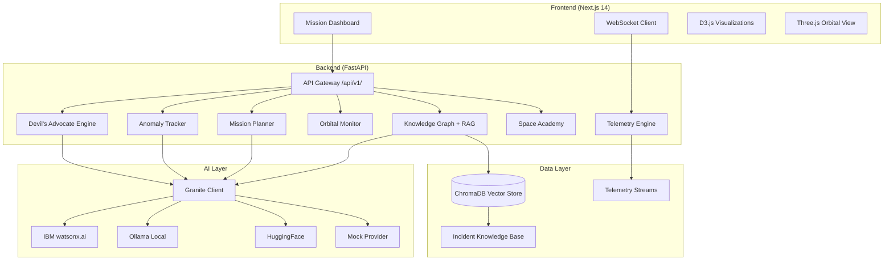

<p align="center">
  
</p>

<h1 align="center">SENTINEL</h1>
<h3 align="center">AI Flight Readiness Devil's Advocate</h3>

<p align="center">
  <em>Combating organizational blindness in spaceflight decision-making using IBM Granite AI</em>
</p>

<p align="center">
  <a href="#quick-start">Quick Start</a> |
  <a href="#architecture">Architecture</a> |
  <a href="#modules">Modules</a> |
  <a href="#api-documentation">API Docs</a> |
  <a href="#demo">Demo</a>
</p>

---

## The Problem

**Organizational blindness kills astronauts.**

The pattern repeats across decades of spaceflight history:

| Incident | Year | Root Cause |
|----------|------|------------|
| **Challenger** | 1986 | O-ring concerns dismissed under schedule pressure |
| **Columbia** | 2003 | Foam strike damage normalized over 22 missions |
| **Starliner CFT** | 2024 | Helium leaks & thruster failures accumulated over 10-year delays |

In each case, individual engineers raised concerns that were overridden by organizational momentum, schedule pressure, and normalization of deviance. The information existed to prevent disaster -- but decision-makers lacked the tools to see cumulative risk clearly.

## The Solution

**SENTINEL** is an AI-powered flight readiness platform that acts as an institutional Devil's Advocate -- surfacing hidden risks, challenging go-fever bias, and ensuring no critical concern goes unheard.

Built on **IBM Granite** foundation models, SENTINEL provides seven integrated modules that together form a comprehensive mission safety intelligence system.

---

## Architecture



---

## Tech Stack

| Layer | Technology | Purpose |
|-------|-----------|---------|
| **Frontend** | Next.js 14, TypeScript, Tailwind CSS | App shell, routing, UI |
| **Visualization** | D3.js, Three.js, Framer Motion | Risk timelines, orbital view, animations |
| **Backend** | FastAPI, Python 3.11+, Pydantic v2 | API, business logic, WebSocket |
| **AI Engine** | IBM Granite (via watsonx.ai / Ollama / HuggingFace) | NLP, risk analysis, RAG |
| **Vector Store** | ChromaDB | Document embeddings, similarity search |
| **Containerization** | Docker, Docker Compose | One-command deployment |
| **Data Sources** | NASA API, Space-Track.org | Orbital data, space weather |

---

## Quick Start

### Docker Compose (Recommended)

```bash
# Clone the repository
git clone https://github.com/nikhilsrikant/SENTINEL-AI-Flight-Readiness-Devil-s-Advocate.git
cd SENTINEL-AI-Flight-Readiness-Devil-s-Advocate

# Configure environment
cp .env.example .env
# Edit .env with your API keys (or leave defaults for mock mode)

# Start all services
docker-compose up --build
```

The platform will be available at:
- **Frontend**: http://localhost:3000
- **Backend API**: http://localhost:8000/api/docs
- **ChromaDB**: http://localhost:8500

### Manual Setup

#### Backend

```bash
cd backend
python -m venv venv
source venv/bin/activate  # Windows: venv\Scripts\activate
pip install -r requirements.txt
uvicorn backend.main:app --host 0.0.0.0 --port 8000 --reload
```

#### Frontend

```bash
cd frontend
npm install
npm run dev
```

#### Seed Knowledge Base

```bash
cd backend
python scripts/seed_knowledge_base.py
```

---

## Modules

### 1. Devil's Advocate Engine

The core module. Analyzes mission parameters and actively argues against launch readiness, surfacing risks that organizational pressure might suppress.

- Generates structured counter-arguments using IBM Granite
- Scores cumulative risk with temporal decay modeling
- Produces "What would Feynman ask?" challenge questions


### 2. Anomaly Tracker

Real-time anomaly detection and pattern matching against historical incidents.

- Continuous telemetry analysis
- Pattern matching against Challenger, Columbia, and Starliner failure modes
- Severity escalation with human-in-the-loop confirmation


### 3. Mission Planner

AI-assisted mission timeline planning with risk-aware scheduling.

- Generates mission phase breakdowns
- Identifies schedule pressure indicators (go-fever)
- Suggests hold points based on historical failure patterns


### 4. Orbital Monitor

3D orbital visualization with conjunction analysis and debris tracking.

- Three.js orbital mechanics rendering
- Space-Track.org TLE data integration
- Collision probability calculations


### 5. Telemetry Engine

Real-time telemetry streaming and anomaly detection via WebSocket.

- Sub-second telemetry data streaming
- D3.js real-time charting
- Threshold-based alerting with historical baseline comparison


### 6. Knowledge Graph

RAG-powered knowledge base of spaceflight incidents and lessons learned.

- ChromaDB vector store with semantic search
- Incident cross-referencing and pattern discovery
- Natural language querying of historical data


### 7. Space Academy

Interactive educational module teaching organizational failure patterns.

- Scenario-based learning from real incidents
- Quiz system with AI-generated explanations
- Progressive difficulty curriculum


---

## IBM Granite Integration

SENTINEL uses IBM Granite foundation models through a flexible provider architecture:

```
GraniteClient
├── watsonx.ai (Production - IBM Cloud)
├── Ollama (Development - Local granite-code:8b)
├── HuggingFace (Fallback - API inference)
└── Mock Provider (Demo/Testing)
```

### Provider Fallback Chain

The system automatically fails over between providers:

1. **Primary**: IBM watsonx.ai with `ibm/granite-13b-chat-v2`
2. **Secondary**: Local Ollama with `granite-code:8b`
3. **Tertiary**: HuggingFace Inference API
4. **Fallback**: Pre-computed mock responses (always available)

### Key AI Capabilities

| Capability | Granite Usage |
|-----------|--------------|
| Risk Analysis | Structured JSON risk factor extraction |
| Counter-Arguments | Devil's advocate reasoning generation |
| Pattern Matching | Incident similarity via embeddings |
| RAG Queries | Knowledge base Q&A with citations |
| Scenario Generation | What-if simulation parameters |

---

## API Documentation

The backend exposes a RESTful API under `/api/v1/` with full OpenAPI documentation.

### Key Endpoints

| Method | Endpoint | Description |
|--------|----------|-------------|
| `POST` | `/api/v1/devils_advocate/analyze` | Run risk analysis on mission parameters |
| `GET` | `/api/v1/anomaly_tracker/anomalies` | List detected anomalies |
| `POST` | `/api/v1/knowledge_graph/query` | RAG query against incident database |
| `GET` | `/api/v1/mission_planner/missions` | List mission plans |
| `GET` | `/api/v1/orbital_monitor/objects` | Get tracked orbital objects |
| `WS` | `/api/v1/telemetry_engine/stream` | Real-time telemetry WebSocket |
| `GET` | `/api/v1/space_academy/lessons` | Get available lessons |
| `GET` | `/api/v1/health` | Platform health check |

### Response Envelope

All responses follow a standard envelope format:

```json
{
  "status": "success",
  "data": { ... },
  "error": null
}
```

Interactive API documentation is available at `/api/docs` (Swagger UI) and `/api/redoc` (ReDoc).

---

## Demo

> **Demo Video**: [Coming Soon - YouTube Link]

### Hero Demo: Starliner CFT Timeline

The flagship demonstration replays the Boeing Starliner Crew Flight Test timeline (2014-2025), showing how SENTINEL would have flagged cumulative risk escalation:

1. **2014**: Contract award -- baseline risk established
2. **2019**: OFT-1 software failures -- risk score jumps
3. **2021-2022**: Valve corrosion delays -- pattern matching triggers
4. **2024**: CFT launch with helium leaks -- Devil's Advocate triggers critical alert
5. **2024**: Crew return on SpaceX -- SENTINEL's prediction validated

---

## Project Structure

```
SENTINEL-AI-Flight-Readiness-Devil-s-Advocate/
├── backend/
│   ├── main.py                 # FastAPI application
│   ├── clients/                # AI provider clients
│   ├── connectors/             # External data connectors
│   ├── models/                 # Pydantic data models
│   ├── routers/                # API route handlers
│   ├── services/               # Business logic
│   ├── scripts/                # Utility scripts
│   └── mock_data/              # Mock response data
├── frontend/
│   ├── src/
│   │   ├── app/                # Next.js App Router pages
│   │   ├── components/         # React components
│   │   ├── hooks/              # Custom React hooks
│   │   └── lib/                # Utilities, types, constants
│   └── public/                 # Static assets
├── data/
│   ├── starliner_timeline.json # Hero demo timeline data
│   └── incidents/              # Structured incident records
├── docker-compose.yml          # Full stack orchestration
├── .env.example                # Environment variable template
└── README.md                   # This file
```

---

## Team

| Name | Role |
|------|------|
| [Team Member 1] | Full Stack / AI Integration |
| [Team Member 2] | Frontend / Visualization |
| [Team Member 3] | Backend / Data Engineering |
| [Team Member 4] | Research / Domain Expert |

---

## License

This project is licensed under the MIT License - see the [LICENSE](LICENSE) file for details.

---

<p align="center">
  <strong>SENTINEL</strong> -- Because the next Challenger moment is preventable.
</p>
